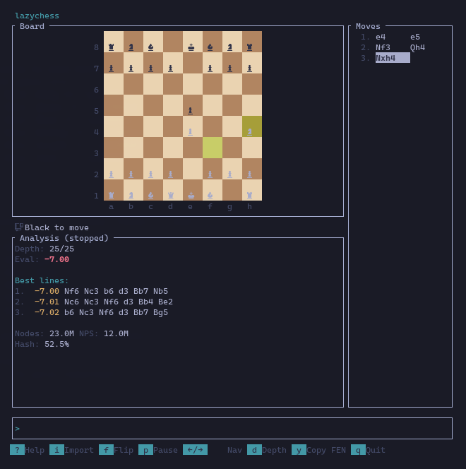

# LAZYCHESS

TUI for evaluating chess positions with Stockfish.



## Prerequisites

Install rust and Stockfish:

```bash
brew install rust stockfish
```

## Installation

```bash
cargo install --path .
```

## Usage

```bash
lazychess
```

### Commands

- Enter moves in standard algebraic notation (e.g., `e4`, `Nf3`, `O-O`)
- `fen <FEN>` - Load a position from FEN string
- `flip` - Flip the board orientation
- `reset` - Start a new game

### Navigation

- `Left` / `Right` - Step through moves
- `Home` / `End` - Jump to start/end of game

### Analysis

- `Space` - Pause/resume engine analysis
- The evaluation is shown from the perspective of the side to move (+ is better for them)