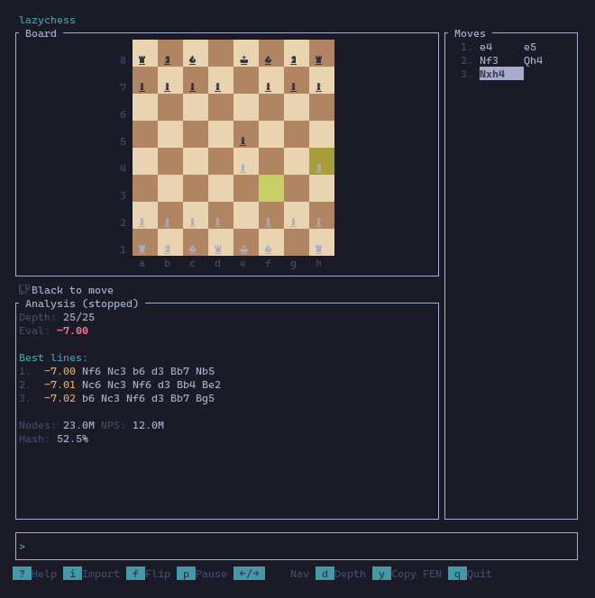

# LAZYCHESS

TUI for evaluating chess positions with Stockfish.



## Installation

### Homebrew

```bash
brew install benwyrosdick/tap/lazychess
```

This will also install Stockfish as a recommended dependency.

### From Source

Install rust and Stockfish:

```bash
brew install rust stockfish
```

Then build and install:

```bash
cargo install --path .
```

## Usage

```bash
lazychess
```

### Commands

- Enter moves in standard algebraic notation (e.g., `e4`, `Nf3`, `O-O`)
- `fen <FEN>` - Load a position from FEN string
- `flip` - Flip the board orientation
- `reset` - Start a new game

### Navigation

- `Left` / `Right` - Step through moves
- `Home` / `End` - Jump to start/end of game

### Analysis

- `1`, `2`, `3` - Play the best move from analysis line 1, 2, or 3
- The evaluation is shown from the perspective of the side to move (+ is better for them)